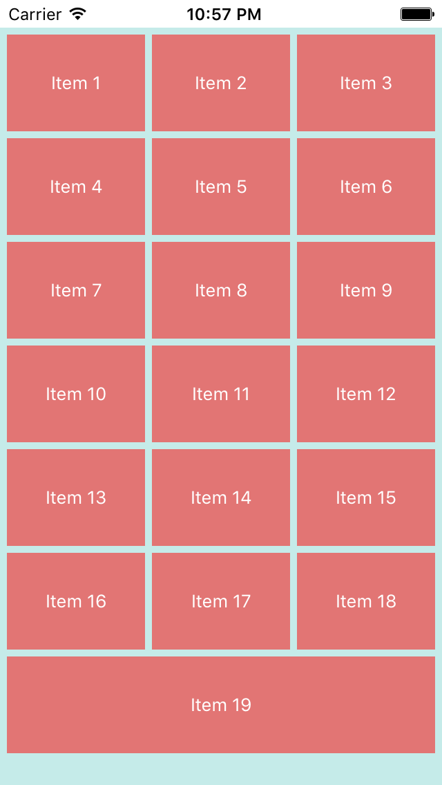

ASJCollectionViewFillLayout
===========================

The standard availabe UICollectionViewLayout does the job well, but the UI may look asymmetric, depending on the number of items the collection view is displaying. This small layout class attempts to solve this problem. This is a UICollectionViewLayout that fills the full width of the collection view.

# Usage

Creating an ASJCollectionViewFillLayout is easy. It has a simple interface consisting of three properties which are IBInspectable. This means that they can be set using the interface builder of your choice; Xibs or Storyboards. You can also use the traditional delegate way to retun the attributes you wish to use.

```
@property (nonatomic) IBInspectable NSInteger numberOfItemsInRow;
```
Sets the number of items to show in one row.

```
@property (nonatomic) IBInspectable CGFloat itemHeight;
```
Sets the height of an item. The width will be calculated to fill the view.

```
@property (nonatomic) IBInspectable CGFloat itemSpacing;
```
Sets the distance between two collection view items.



###To-do
- Handle case of total collection view items being less than the number of items in one row

# License

ASJCollectionViewFillLayout is available under the MIT license. See the LICENSE file for more info.
